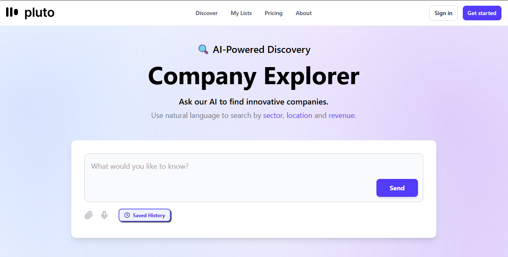

Pluto AI – Company Explorer
AI-powered discovery tool to explore innovative companies using natural language.

---

Overview

Pluto AI is a modern web application that allows users to discover companies through simple, natural language queries.
Instead of filtering through complex forms, users can just ask:

> *"Find AI startups in Berlin with high revenue"*

The system processes the request and returns relevant companies instantly.

  

---

Features
* Natural language search (AI-powered)
* Company discovery by:
  * Sector
  * Location
  * Revenue
* Clean chat-style interface
* Saved search history
* Simple and intuitive UX

---

Tech Stack
* Frontend: React / Next.js *(adjust if needed)*
* Styling: Tailwind CSS
* Backend: Node.js *(adjust if needed)*
* AI Integration: OpenAI API *(or whichever you used)*
* Database: *(optional – add if used)*

---

---

Use Case

Pluto AI simplifies company research for:
* Founders looking for competitors
* Investors scouting opportunities
* Students exploring industries
* Professionals researching markets

---

Contribution

This is a team project. Contributions and improvements are welcome.

---

My Contribution
* Designed and implemented authentication entry points (Sign in & Get started) in the navigation
* Built interactive dropdown functionality in the results section to allow users to add companies to their personal list (improved user flow)
* Developed the "My Lists" page for managing saved companies
* ontributed to UI/UX improvements for a smoother and more intuitive user experience

